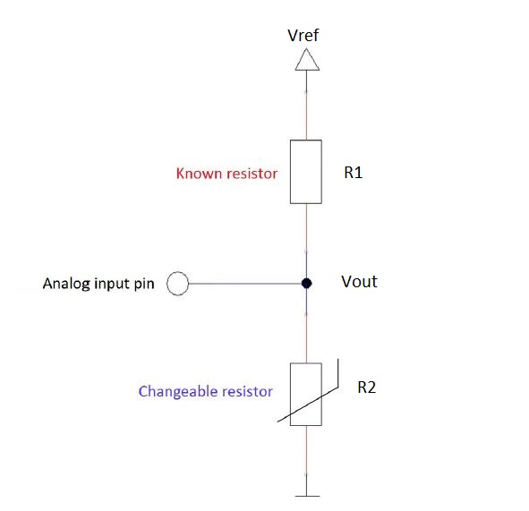
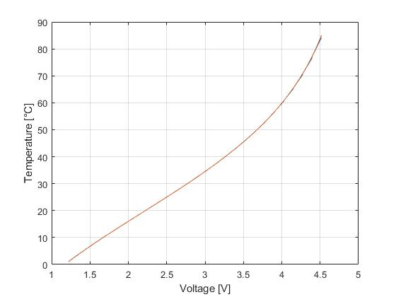
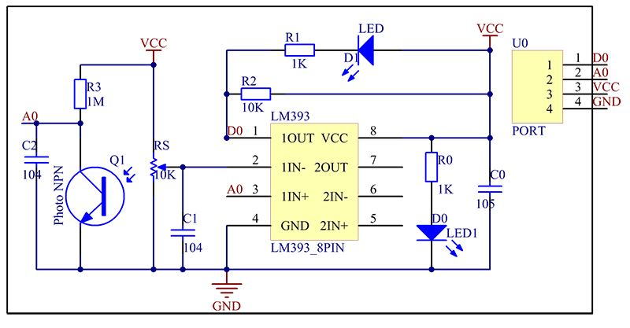
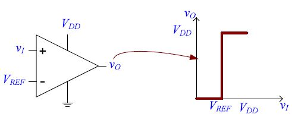

# Lab-chamber
## Final project of Data Acquisition Systems IST 

### Anna Toschi

## Introduction
This project consists in the realization of a set of controls that can be implemented in a laboratory chamber before a scientific experiment and it is realized using Arduino UNO and some sensors.

Sometimes it can be very important that the temperature inside the laboratory is within a specific range because of the sample that is under analysis. For this reason a temperature sensor is used in order to control that the temperature is compatible with the requests. In case it is not, an LED will turn on.

During an experiment it can also be very important that the support on which the sample and the machines are located, like a table of the lab, is very stable, or for example that nobody is too close to the table because of safety reasons, both of the people and the sample. For this reason a sonar sensor is used in order to measure the distance from sample and if this distance is too small a red LED turns on. 

Many times in the scientific laboratories there are some inflammable materials which can be very dangerous. It is very important that the laboratory is safe, for this reason a flame sensor will be used to detect the possible presence of a flames. 

## Components used
## Board
Arduino UNO
## Outputs

3 red LEDs

1 green LED
## Inputs

1 button

3 sensors
### Sensors
1) HC-SR04 ultrasonic sensor: https://www.electroschematics.com/wp-content/uploads/2013/07/HCSR04-datasheet-version-1.pdf
2) KY-013 temperature sensor: https://datasheetspdf.com/pdf-file/1402026/Joy-IT/KY-013/1
3) KY-026 flame sensor: https://datasheet4u.com/datasheet-parts/KY-026-datasheet.php?id=1402037

## Temperature
### Sensor 
In order to measure the temperature of the room an NTC thermistor has been used.
Thermistors are variable resistors that change their resistance with temperature. In particular the sensor used is called KY-013 which consists of a NTC thermistor and a 10 kΩ resistor. NTC thermistor are made by semiconductive materials whose resistance decreases with the temperature: indeed by icreasing the temperature the number of active charge carriers increases and the more charge carriers that are available, the more current a material can conduct.

.png)

The operating voltage is 5V and it allows temperature measurements within the range of -55°C and 125°C with an accuracy of ±0.5°C.

The voltage across the thermistor is the analog input that can be measured. The circuit is a voltage divider: 

Vout = Vref R2/(R1+R2)

Where R1 is the known resistance, that in this case is 10kΩ, while R2 is the variable resistance of the thermistor and Vref in this case is 5 V supply voltage. In this way it is possible to find the resistance R2 of the thermistor, knowing the value of the voltage across it.

R2 = R1(Vref/Vout-1)

This quantity is related to the temperature through the Steinhart–Hart equation:

1/T = A + B lnR + C (lnR)^3
It is an empirical expresion with T expressed in Kelvin and R in Ohm. A, B and C are the Steinhart-Hart coefficients which vary depending on the type and model of thermistor and the temperature range of interest. In this case:

A = 0.001129148 
B = 0.000234125
C = 0.000000087674 

At room temperature the value of the voltage is between 2 and 3 V.

### Look-up Table
Since Arduino, for complicated operations like logarithms, is not very efficient, instead of calculating the temperature using the Steinhart–Hart equation, the temperature is calculated using look-up tables. In particular a finite number of values of the voltage are stored in an array and the corresponding values of temperature are calculated outside Arduino (in Matlab) and an array for those values of temperature is created. In order to find the other values of temperature a linear interpolation is performed. 
In particular this introduces an error in the calculation of temperature. 
This has as advantage to reduce the computational cost of the calculation of the temperature but it introduces an error. The maximum value of the error introduced is 0.8587°C.
The plots of the temperature calculated by means of lookup tables and linear interpolation and the temperature calculated by means of Steinhart–Hart equation, as functions of the voltage, are shown in figure.

It is possible to notice that for room temperature the two curves are well superposed, only at higher temperatures the difference is more visible.

## Distance
### Sensor 
In order to measure the distance of an object/person from the table on which the sample and all the machines are located, an ultrasonic sensor HC-SR04 has been used. This sensor emits an ultrasound which travels through the air and if there is an object or obstacle on its path it will bounce back to the source. Considering the travel time and the speed of the sound it is possible to calculate the distance. 
The HC-SR04 Ultrasonic sensor has 4 pins: Ground, VCC, Trig and Echo. The Ground and the VCC pins of the sensor are connected to the Ground and the 5 volts pins on the Arduino Board respectively. When the trigger pin is high the sensor creates an 8 cycle burst of ultrasound at 40 kHz and when this ultrasonic signal finds an obstacle it is refelected towards the sensor. Once the wave is returned after it getting reflected by any object the Echo pin goes high for a particular amount of time which will be equal to the time taken for the wave to return back to the sensor.
Therefore, in order to measure the distance between the obstacle and the sensor it is necessary to calculate the time of travel of the signal, that means the time in which the echo stays high. 

### Input Capture Mode 
To to do that the Input Caputure mode of the Timer 1 of Arduino UNO has been used. It is a 16-bits timer which incorporate an input capture unit that can capture external events and give them a time-stamp indicating the time of occurrence. When a change of the logic level occurs on the input capture pin, which corresponds to Pin 8 or Arduino (PB0), the 16-bits value of the counter TCNT1 is written inot the ICR1 register. The echo pin is connected to the input capture pin, while the trigger pin can be connected to any I/O pin of Arduino.
A signal of 10 µs is sent by setting the trigger pin high for this time interval. It is possible to decide which edge on the input capture pin is used to trigger a capture event: initially this set to the rising edge so that when the echo pin becomes high the value of the counter is saved in a variable and afterward it is set to the falling edge so that when the echo pin becomes low the second value of the counter is saved. 

By making the difference between those two values and divide by the clock frequency, which depends on the crystal inside Arduino and in this case is 16 MHz, it is possible to get the time in which the signal has travel.
### Calculation of distance: speed of sound
By multiplying the time interval in which the signal has travel for the speed of sound and dividing by two, since we need to take into account that the signal crosses twice the distance between the obstacle and the sensor, it is possible to get the distance:

distance = (time_interval* speed_sound) / 2

It is important to consider that the speed of sound depends on temperature. It is possible to consider the linear model:

speed_sound(T) = (331,45 + (0,62 * T)) m/s

BY calculating the temperature it is possible to calculate the corresponding speed of sound and the corresponding distance.
In end end when the distance is below a critical value an LED is turned on. 
Le't notice from the code that an initial signal is sent in the setup and then it is sent again only when the prevoius one is recevied and the corresponding distance has been calculated. In this way it is possible to avoid the superposition of two signals. 

## Flame
### Sensor
The sensor KY-026 is used. It is principally composed by an Infra-red sensor: when fire burns it emits a small amount of infra-red light, this light will be received by the photodiode on the sensor module. 
The sensor has both an analogic and digital output. It consists of a 5mm infra-red receiver LED, a LM393 dual differential comparator a 3296W trimmer potentiometer, resistors and capacitors and two indicator LEDs, one is on when the sensor is well connected and the second is on if flames are detected.
The schematic is shown in figure.

The photodiode detects light in the range 760 nm to 1100 nm, which corresponds to the range of wavelength of the radiation emitted by flames. The photodiode is made by a transistor: light striking the semiconductor frees electrons and holes and causes current to flow in the base region.
According to the intensity of the light a different current will flow and a different voltage will correspond to the node indicated by A0 in the figure and it is also the analog output of the sensor and the input- on the comparator LM393. The second input is the voltage given by the potentiometer: it is a three-terminal resistor (Rs in figure) with a sliding contact that forms an adjustable voltage divider. The comparator consists in an amplifier where the two inputs are the one described and the output is the digital pin of the flame sensor.

It is possible to control the sensitivy by adjusting the potentiometer and so changing the reference voltage of the comparator.
Since the analog output was already used for the measurement of the temperature, the digital output is used. 
When it gets high it means that flame is detected and an LED will turn on.

### False alarms

The wavelength detected by the photodiode is the one emitted by flames, but can be due to the presence of other sources, such as the human body or some machines in the same room. For this reason it can happen that the due to the enviroment the sensor will send a false alarm. 

## Alarm message

This kind of device could be used inside a laboratory and if for example you leave the room for some time you want to know if during your absence something went wrong. In order to do this it is not enough to make the red LEDs turn on if something is wrong in the current moment and the green LED if not because in this way it is not possible to keep track of what happened during your absence. In order to do this a button is used: the green LED can turn on only if the button is pressed and everything is fine (normal temperature, not flames detected and nothing too close to the table), but when something goes wrong it turns off and it cannot turn on if the button 
is not pressed again.Therefore if before leaving the room everything was fine and the LED was on and when you come back in the laboratory the green LED is off, it means that during your absence something went wrong. if pressing the button the LED turns on again it means that the problem now is solved, if not it means that there is still something undesired.

